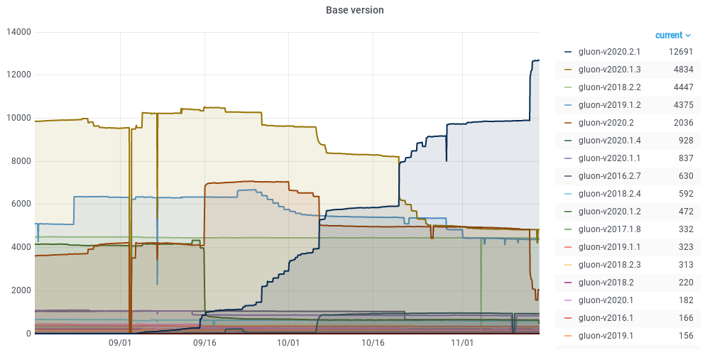
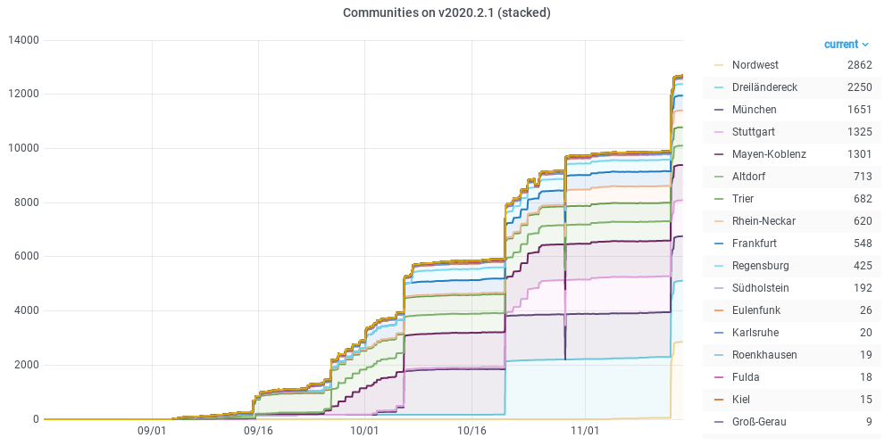

# gluon-census-exporter

This is a tool that scrapes multiple Gluon communities for their Gluon base version, so we have an indicator on what versions and to which amount are in active use. The output is written to a file in the Prometheus Exposition Format and expected to be scraped as a node-exporter textfile.

## communities.json

This file tracks the communities and their metadata URLs. Multiple URLs can be given, we currently handle `meshviewer.json` (old and new) as well as `nodes.json` (v1, v2).

*Please add your own community and keep it's URLs up to date.*

## How does it look?

The full Grafana dashboard can be found over at https://stats.darmstadt.freifunk.net/d/CA5PRFmMz/gluon-census.
